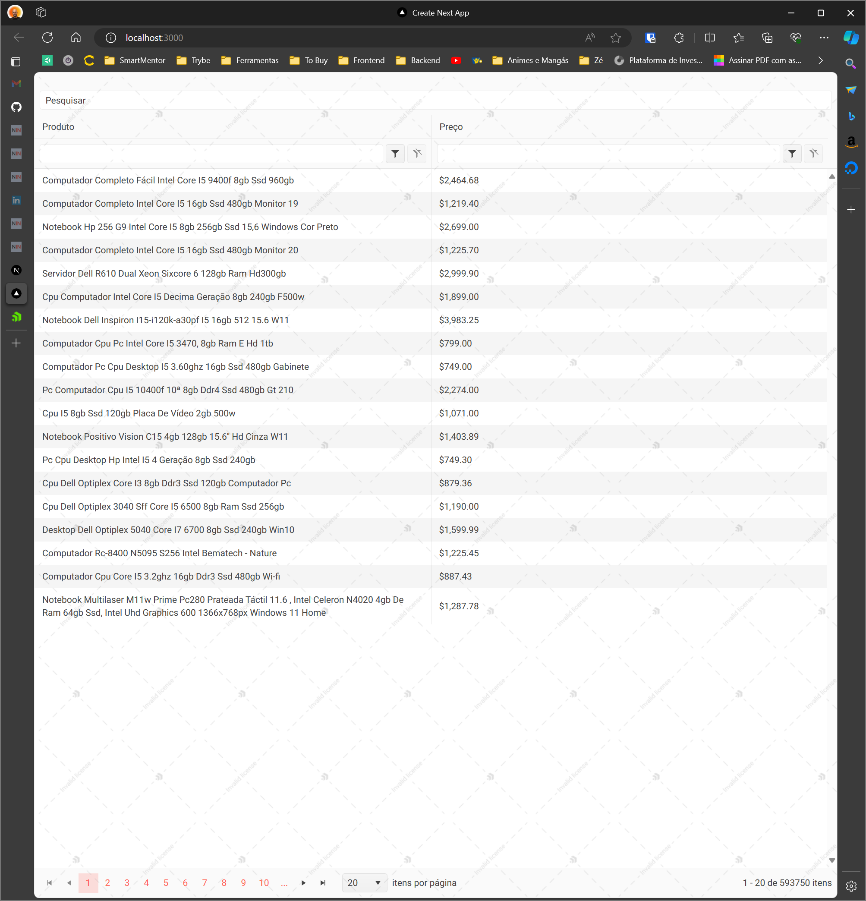
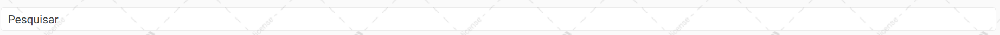
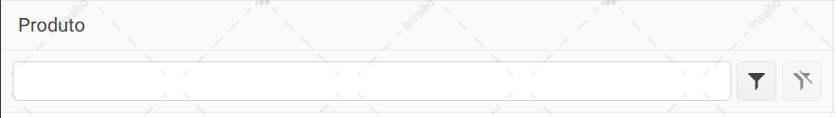
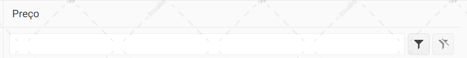
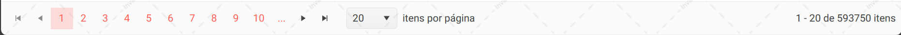

Este é um projeto [Next.js](https://nextjs.org/) criado com  [`create-next-app`](https://github.com/vercel/next.js/tree/canary/packages/create-next-app).

A aplicação consiste em uma busca de produtos utilizando a api do mercado livre.



As funcionalidades consistem em:
- Pesquisar por um produto no campo de busca



- Filtrar por um produto na tela



- Filtrar por preço na tela



- Paginação dos produtos



## Começando

Primeiro, instale as dependências:

```bash
npm install
# or
yarn install
```

No caso deste desafio, foi utilizado a api do mercado livre para a busca produtos, basta apenas utilizar o .env.example que já está configurado para que a busca funcione.

```bash
cp .env.example .env
```

Porém, se por algum motivo a api do mercado livre mudar, basta apenas alterar a variável de ambiente `NEXT_PUBLIC_MERCADO_LIVRE_SEARCH_URL` no arquivo `.env` para que a busca funcione.

```bash
NEXT_PUBLIC_MERCADO_LIVRE_SEARCH_URL=https://api.mercadolibre.com/sites/MLB/search
```

Em seguida, execute o servidor de desenvolvimento:

```bash
npm run dev
# or
yarn dev
```

abra [http://localhost:3000](http://localhost:3000) com o seu navegador para ver o resultado.

## Executando os testes

Para executar os testes, execute o seguinte comando:

```bash
npm run test
# or
yarn test
```
